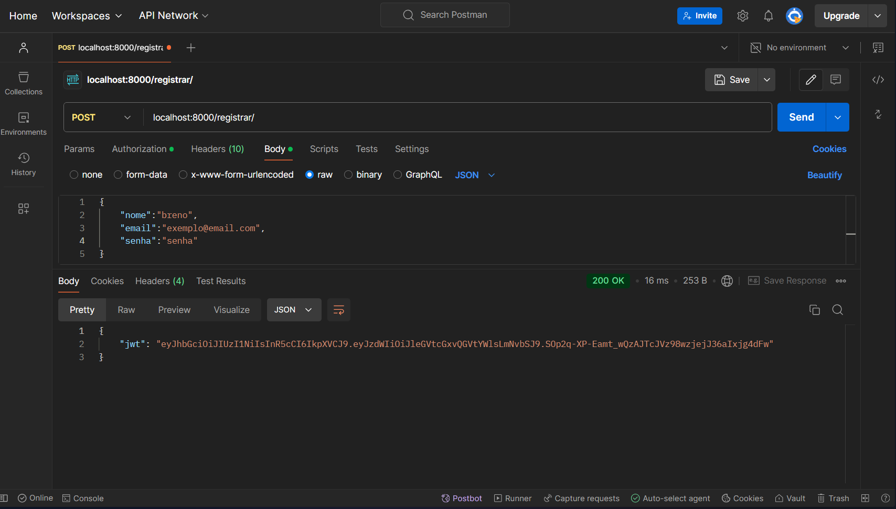
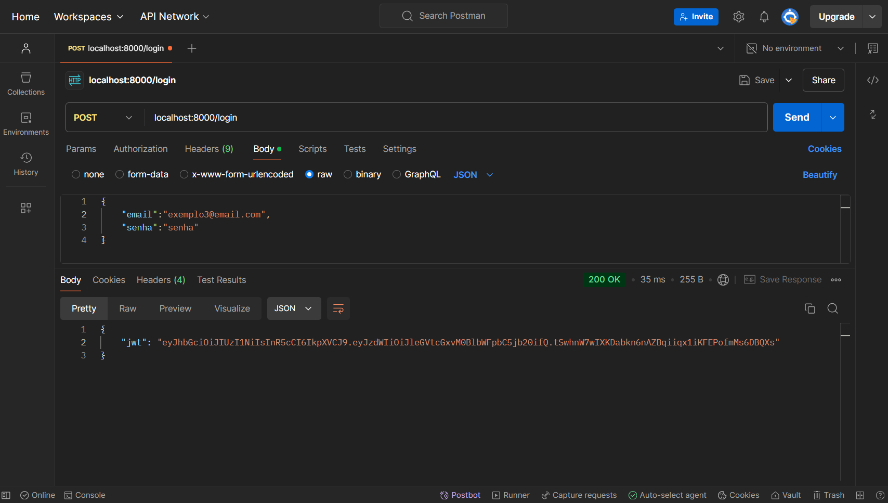
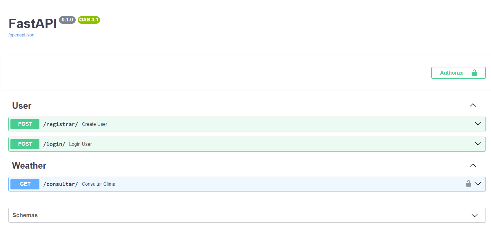
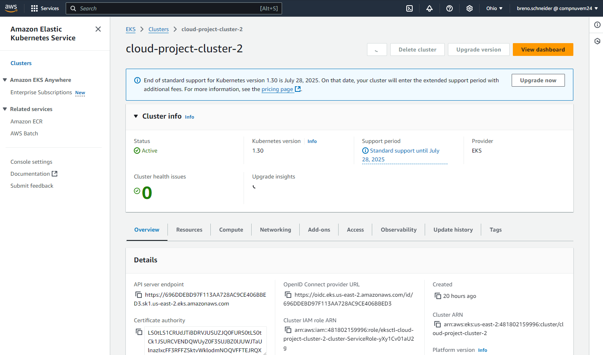

# 📚 Cloud

## 👨‍🎓 Nome do Aluno
**Breno Schneider Salles de Oliveira**

## 📝 Descrição do Projeto
Este projeto é uma **API dockerizada** integrada com um banco de dados **PostgreSQL**, desenvolvida para **gerenciar usuários** com funcionalidades de registro, login e autenticação utilizando **JWT**. Utilizando tecnologias como **Python, FastAPI, Docker e SQLAlchemy**, a aplicação realiza **web scraping** no serviço **OpenWeatherMap** para obter a previsão do clima da cidade de **São Paulo** nos próximos **5 dias**. A API permite que os usuários autenticados consultem informações detalhadas como temperatura prevista, condições climáticas, umidade e velocidade do vento. A integração com o banco de dados assegura o armazenamento seguro das credenciais dos usuários e a gestão eficiente das sessões autenticadas, proporcionando uma experiência segura e confiável para acessar dados meteorológicos atualizados.

### **Funcionalidades Implementadas:**
- **Scraping de Dados:** Coleta de informações específicas de **[OpenWeatherMap]**.
- **API RESTful:** Fornece endpoints para acessar os dados coletados.
- **Autenticação JWT:** Segurança para proteger os endpoints da API.
- **Containerização com Docker:** Facilita a implantação e execução da aplicação em qualquer ambiente.

## 🚀 Como Executar a Aplicação

### **Pré-requisitos**
- [Docker](https://www.docker.com/get-started) instalado na sua máquina.
- [Git](https://git-scm.com/downloads) instalado.

### **Passo a Passo**

#### **Opção 1:**

1. **Baixe o arquivo docker-compose.yaml e armazene-o em um diretório vazio:** 

    <div style="margin-top:15px;"></div>

    - [docker-compose.yaml](https://raw.githubusercontent.com/brnoschsaloli/nuvemprojeto/main/compose-dockerhub/docker-compose.yaml)

<div style="margin-top:15px;"></div>

2. **Abra o terminal na pasta que o arquivo foi baixado**

<div style="margin-top:15px;"></div>

3. **Iniciar os Contêineres com Docker Compose:**

    <div style="margin-top:15px;"></div>

    ```bash
    docker compose up -d
    ```

<div style="margin-top:15px;"></div>

4. **Acessar a Aplicação:**

    <div style="margin-top:15px;"></div>

    - A API estará disponível em [http://localhost:8000/docs](http://localhost:8000/docs).


#### **Opção 2:**

1. **Clone o repositório:** 

    <div style="margin-top:15px;"></div>

    ```bash
    git clone https://github.com/brnoschsaloli/nuvemProjeto.git
    cd nuvemProjeto
    ```
2. **Entre na pasta onde está o arquivo docker-compose.yaml:** 

    <div style="margin-top:15px;"></div>

    ```bash
    cd compose-dockerhub
    ```
3. **Certifique-se de que o Docker está rodando no seu computador**

<div style="margin-top:15px;"></div>

4. **Iniciar os Contêineres com Docker Compose:**

    <div style="margin-top:15px;"></div>

    ```bash
    docker compose up -d
    ```

<div style="margin-top:15px;"></div>

5. **Acessar a Aplicação:**

    <div style="margin-top:15px;"></div>

    - A API estará disponível em [http://localhost:8000/docs](http://localhost:8000/docs).

## 📚 Documentação dos Endpoints da API

### **Autenticação**
- **Registrar Usuário**
  - **URL:** `/register/`
  - **Método:** `POST`
  - **Body:**
    ```json
    {
      "nome": "seu nome",
      "email": "seu email",
      "senha": "sua senha"
    }
    ```
  - **Descrição:** Registra um novo usuário e retorna um token JWT.

- **Login**
  - **URL:** `/login/`
  - **Método:** `POST`
  - **Body:**
    ```json
    {
      "email": "seu email",
      "senha": "sua senha"
    }
    ```
  - **Descrição:** Autentica um usuário e retorna um token JWT.

### **Previsão do Tempo**
- **Consultar Clima**
  - **URL:** `/consultar/`
  - **Método:** `GET`
  - **Headers:**
    ```
    Authorization: Bearer <seu_token_jwt>
    ```
  - **Descrição:** Retorna a previsão do tempo baseada nos dados coletados pelo web scraping.
  - **Resposta:**
    ```json
    {
      "previsao": [
        {
          "data": "2024-10-15",
          "temperatura_minima": 16.55,
          "temperatura_maxima": 26.89,
          "descricao": "nublado"
        },
        {
          "data": "2024-10-16",
          "temperatura_minima": 19.94,
          "temperatura_maxima": 30.03,
          "descricao": "nublado"
        }
        // Mais previsões...
      ]
    }
    ```

## 📸 Screenshots dos Endpoints Testados


*Descrição da screenshot: Mostrando a resposta do endpoint `/register/`.*



*Descrição da screenshot: Mostrando a resposta do endpoint `/login/`.*


*Descrição da screenshot: Mostrando a resposta do endpoint `/consultar/` com a previsão do tempo.*

## 🎥 Vídeo de Execução da Aplicação

<a href="https://youtu.be/Z46RP-SC9Jo" style="display: block; border: 2px solid black; padding: 10px; width: fit-content; margin-bottom: 20px;">
    
</a>

*Descrição: Vídeo demonstrando a execução da aplicação e a interação com os endpoints da API.*

## 📦 Link para o Docker Hub do Projeto
[](https://hub.docker.com/r/brnoschsaloli/nuvemprojeto)

*Descrição: Link para a imagem Docker do projeto no Docker Hub.*

---

## 🌩️ Implementação na AWS

A aplicação foi implementada na AWS utilizando o Amazon EKS (Elastic Kubernetes Service). Os passos abaixo descrevem como o cluster foi criado e como a aplicação foi implantada.

### **Passos para Implementação na AWS**

1. **Instalar o eksctl no AWS CloudShell:**

    ```bash
    # para sistemas ARM, defina ARCH para: arm64, armv6 ou armv7
    ARCH=amd64
    PLATFORM=$(uname -s)_$ARCH

    curl -sLO "https://github.com/eksctl-io/eksctl/releases/latest/download/eksctl_$PLATFORM.tar.gz"

    # (Opcional) Verificar checksum
    curl -sL "https://github.com/eksctl-io/eksctl/releases/latest/download/eksctl_checksums.txt" | grep $PLATFORM | sha256sum --check

    tar -xzf eksctl_$PLATFORM.tar.gz -C /tmp && rm eksctl_$PLATFORM.tar.gz

    sudo mv /tmp/eksctl /usr/local/bin
    ```

2. **Criar o cluster EKS:**

    ```bash
    eksctl create cluster --name cloud-project-cluster-2 --region us-east-2 --nodes 2 
    ```

3. **Configurar o kubectl:**

    ```bash
    aws eks --region us-east-2 update-kubeconfig --name cloud-project-cluster-2 
    ```

4. **Aplicar os arquivos no cluster:**

    ```bash
    kubectl apply -f database.yml 
    kubectl apply -f web.yml
    ```

    > **Nota:** Os arquivos `database.yml` e `web.yml` estão localizados na pasta `aws` deste repositório.

5. **Acessar a aplicação:**

    ```bash
    kubectl get svc fastapi-service
    ```

    Este comando retorna um link onde a aplicação está disponível. Exemplo:

    ```
    a40f61fe579dc4e35adae173301d817b-453611502.us-east-2.elb.amazonaws.com
    ```

### 🎥 Vídeo de Execução da Aplicação na AWS

<a href="https://youtu.be/3lt9-nViuZo" style="display: block; border: 2px solid black; padding: 10px; width: fit-content; margin-bottom: 20px;">
    <!-- Substitua 'aws_video_thumbnail.png' pela imagem do thumbnail do vídeo -->
    
</a>

*Descrição: Vídeo demonstrando a execução da aplicação na AWS e a interação com os endpoints da API.*

---